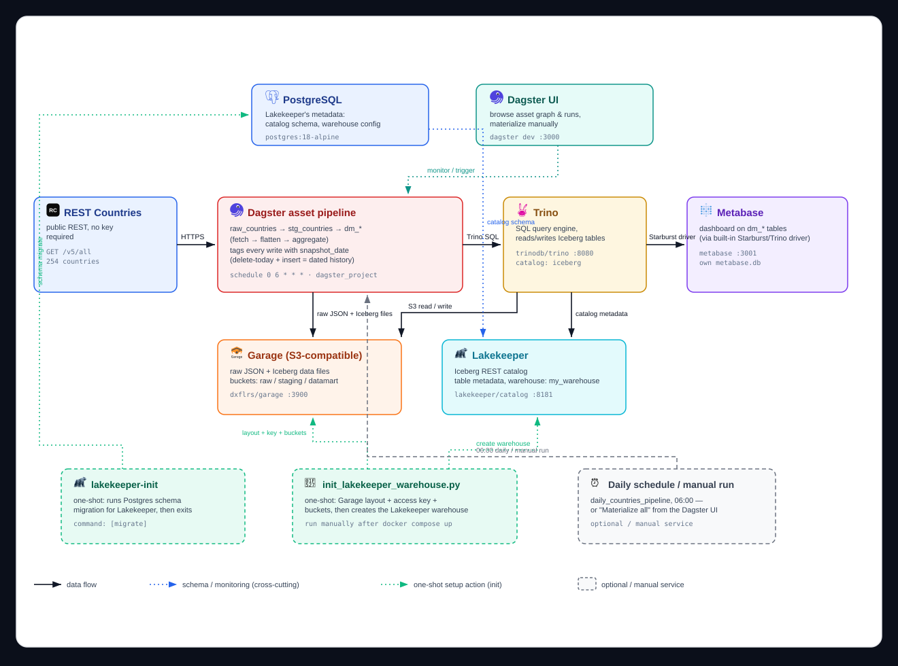

# Dagster Iceberg Panel

Dagster pipeline that fetches country data from the [REST Countries API](https://restcountries.com),
lands it raw in Garage (S3-compatible object storage), cleans it into an
Iceberg staging table (via Lakekeeper + Trino), and builds Iceberg datamart
tables for a [HoloViz Panel](https://panel.holoviz.org) dashboard.

Layers: **raw** (JSON in Garage) → **staging** (Iceberg table) → **datamart** (Iceberg tables).

## Architecture



## Repository Structure

```
.
├── dagster_project/       # Dagster pipeline code
│   ├── assets/             # raw/staging/datamart asset definitions
│   ├── io_managers/        # Iceberg/Garage IO managers
│   └── resources/          # API, Garage, and Trino resource definitions
├── panel_app/             # HoloViz Panel dashboard app
│   ├── dashboard.py         # Chart definitions and page layout
│   └── trino_client.py      # Datamart query helper (reads latest snapshot)
├── docs/                  # Architecture diagram and other docs
├── garage/                # Garage (S3-compatible storage) config
├── scripts/               # One-off setup scripts (e.g. Lakekeeper warehouse init)
├── tests/                 # Unit tests for the pipeline assets
├── trino/
│   └── catalog/            # Trino catalog configuration
├── docker-compose.yml     # Service definitions (Dagster, Garage, Trino, Lakekeeper, Panel, Postgres)
├── Dockerfile             # Shared image for the Dagster and Panel services
├── pyproject.toml         # Python package/dependency definitions
└── .env.example           # Environment variable template
```

## Prerequisites

- Docker + Docker Compose
- A REST Countries API key (`API_TOKEN` in `.env`)
- Python 3.11+ (needed to run `scripts/init_lakekeeper_warehouse.py`, and for
  Dagster/tests outside Docker). Use a virtualenv so these don't pollute your
  global Python:
  ```bash
  python -m venv .venv
  # Windows:
  .venv\Scripts\activate
  # macOS/Linux:
  source .venv/bin/activate

  pip install -e .
  ```

## Run from scratch

1. Copy the env template and fill in real credentials:
   ```bash
   cp .env.example .env
   ```
   `GARAGE_ACCESS_KEY_ID` must follow Garage's own format: `GK` followed by
   24 hex characters (e.g. generate one with `echo "GK$(openssl rand -hex 12)"`)
   — Garage rejects any other format when the key is registered in step 4.
2. Start every service:
   ```bash
   docker compose up -d
   ```
3. Confirm all services are healthy:
   ```bash
   docker compose ps
   ```
4. Bootstrap the cluster: assigns the Garage layout, registers the access key,
   creates the raw/staging/datamart buckets, and creates the Lakekeeper
   warehouse (reads `.env` itself, works the same in PowerShell or bash):
   ```bash
   python scripts/init_lakekeeper_warehouse.py
   ```
5. Verify Trino can see the Iceberg catalog:
   ```bash
   docker compose exec trino trino --execute "SHOW CATALOGS"
   ```
6. Open the Dagster UI at http://localhost:3000 and materialize all assets
   (or click "Materialize all" on the asset graph), or run:
   ```bash
   docker compose exec dagster dagster job execute -m dagster_project -j countries_pipeline_job
   ```
7. Open the Panel dashboard at http://localhost:3001. It connects to Trino on
   startup (host `trino`, port `8080`, catalog `iceberg`, user `dagster`, no
   password/SSL — see `panel_app/trino_client.py`) and renders charts built
   directly from the datamart tables below, each read from their latest
   `snapshot_date`. Region totals and the top-20 cuts (most populous, most
   densely populated) aren't separate tables — the dashboard derives them at
   query time from `dm_subregion_summary` and `dm_countries` respectively:
   - `datamart.dm_currency_distribution` — countries per currency
   - `datamart.dm_language_distribution` — countries per language
   - `datamart.dm_subregion_summary` — population/area/country count per subregion (and, rolled up further, per region)
   - `datamart.dm_countries` — one row per country: population, area, population density, capital

   Reload the page after re-running the pipeline to pick up the newest
   snapshot; the dashboard has no database of its own, so nothing needs
   re-configuring.

The daily schedule (`daily_countries_pipeline`, 06:00) re-runs the full
raw → staging → datamart pipeline automatically once enabled in the Dagster UI.

## Re-running the pipeline

- **Full refresh (fresh raw data):** materialize `raw_countries` (overwrites
  the same raw JSON object in Garage) and let its downstream assets
  (`stg_countries`, `dm_*`) re-materialize.
- **Partial run (staging/datamart only):** select just `stg_countries` and
  the `dm_*` assets in the Dagster UI to reprocess the existing raw JSON
  without re-hitting the API.

Every staging/datamart table carries a `snapshot_date` column and is written
as one dated snapshot per run (delete + insert, keyed on `snapshot_date`), so
history accumulates across days instead of being overwritten — re-running
multiple times on the *same* day just replaces that day's snapshot, staying
idempotent. Datamart queries (and the daily schedule) only ever read the
current day's staging snapshot, so numbers reflect one point in time rather
than the full history.

## Testing

```bash
# activate the venv from Prerequisites first
pip install -e ".[dev]"
pytest
```

Every asset's external resources (`api`, `garage`, `trino`) are Dagster
resources injected at runtime, so tests mock them directly instead of hitting
real services.

## Dashboard development

To run the Panel app outside Docker (with live reload) against an already
running `trino` service:

```bash
pip install -e ".[dashboard]"
export TRINO_HOST=localhost TRINO_PORT=8080 TRINO_USER=dagster TRINO_CATALOG=iceberg TRINO_SCHEMA_DATAMART=datamart
panel serve panel_app/dashboard.py --autoreload --show
```

## Stopping

```bash
docker compose down
```

Stops and removes the containers, but keeps all data (Postgres, Garage,
Dagster home) in their named volumes — a later `docker compose up -d`
picks up right where you left off. The Panel dashboard itself is stateless
(it only reads from Trino), so there's no dashboard data to preserve.

To also wipe all data (raw/staging/datamart tables, everything) and start
clean:

```bash
docker compose down -v
```
